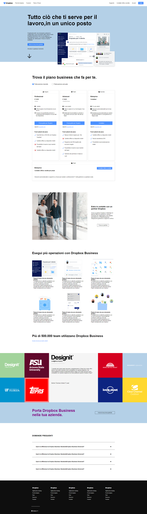

<link rel="stylesheet" href="./css/utils.css">

# htmlcss-dropbox
### Clone landing page dropbox
#### Per questo progetto ho usato solo HTML e CSS.
<head> 

</head>

    
<h2>Vista desktop</h2>

        
    

    
<h2>Vista mobile</h2>

        
    

